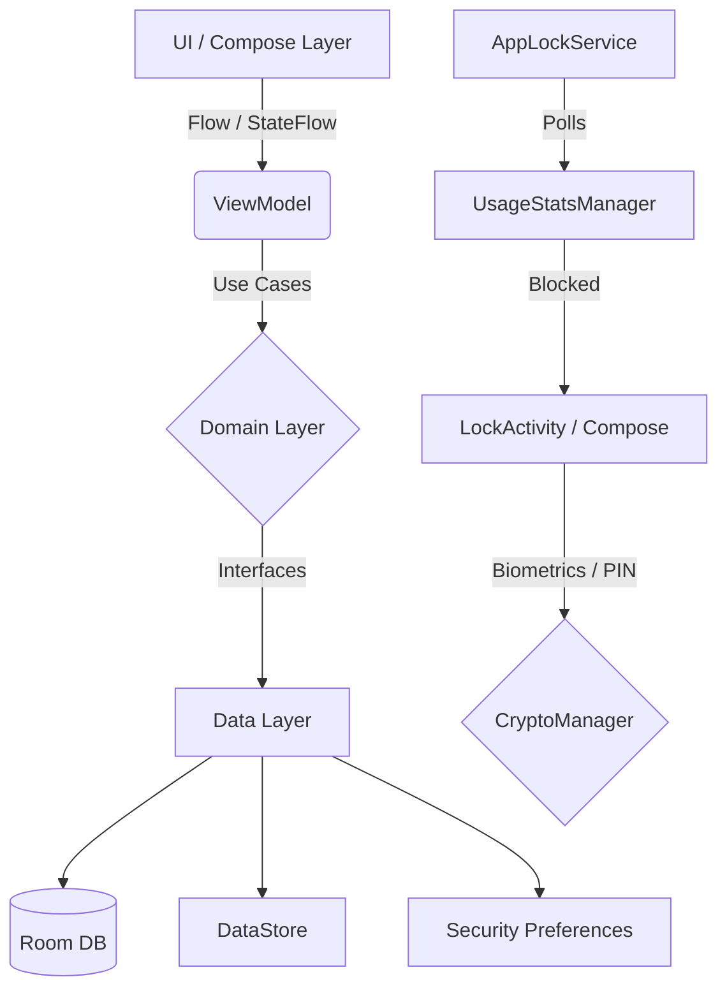

# Android App Locker - Modern Material 3 & Jetpack Compose

A production-ready Android App Locker leveraging the modern Android tech stack, Clean Architecture, and best-in-class security practices.

## 🚀 Tech Stack
- **Language**: Kotlin 1.9+
- **UI Toolkit**: Jetpack Compose & Material 3
- **Architecture**: MVVM + Clean Architecture (Repository Pattern)
- **Dependency Injection**: Hilt
- **Asynchronous & Reactive**: Coroutines & Flow
- **Local Storage**: Room Database & AndroidX Preferences DataStore
- **Build System**: Gradle Kotlin DSL (with Version Catalogs)

## 🛡️ Security Features
- **Hardware-backed Encryption**: `CryptoManager` utilizes `AndroidKeyStore` (AES/GCM) to securely encrypt sensitive payloads without ever keeping secrets in RAM.
- **Biometric Prompt**: Integrated AndroidX Biometrics for secure Fingerprint and Face Unlock capabilities.
- **Secure Preferences**: `EncryptedSharedPreferences` for hashing and verifying PINs securely.
- **Anti-Tampering**:
  - `RootDetectionUtil` prevents the app from running on compromised devices.
  - `FLAG_SECURE` prevents system screenshots and obscures the UI from Recent Apps.

## ⚙️ The Engine
The lock engine works on Modern Android (API 28+) using a robust foreground service (`AppLockService`). It utilizes `UsageStatsManager` to poll `ACTIVITY_RESUMED` events every 200ms. If a locked app is brought to the foreground, `LockActivity` is immediately launched as an overlay using `FLAG_ACTIVITY_NEW_TASK` and `FLAG_ACTIVITY_CLEAR_TASK`.

## 📂 Project Architecture Diagram

## 🏗️ Getting Started
1. **Clone or Open** the project in **Android Studio Koala** (or newer).
2. Sync the project with Gradle files.
3. Select an Emulator (API 30+) or a Physical Device.
4. Click **Run**.
*(Note: Usage Access and Display Over Other Apps permissions will need to be granted manually via Android Settings for the Engine to fully operate).*
